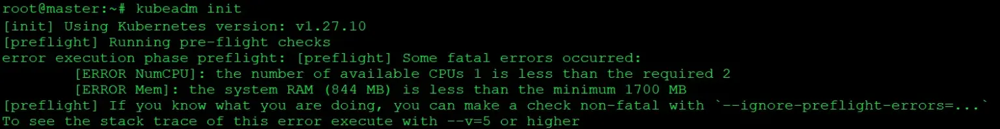

# Number-of-available-CPUs-1-is-less-than-the-required-2
Kubectl runs a series of pre-flight checks to validate the system state before making changes.This error means the host don't have minimum requirement of 2 CPU.
You can ignore the error if you still want to go ahead and install kubernetes on this host.

1. CPU Requirement Not Met:

    Message: ERROR NumCPU: the number of available CPUs 1 is less than the required 2
    Meaning: Kubernetes expects a minimum of 2 CPUs for proper functioning, but your system has only 1 CPU available.
    Implication: Having at least 2 CPUs ensures that Kubernetes can efficiently manage and distribute workloads across nodes in the cluster.
                Insufficient CPUs may lead to degraded performance or instability.

2. Insufficient Memory:

    Message: ERROR Mem: the system RAM (844 MB) is less than the minimum 1700 MB
    Meaning: Kubernetes requires a minimum of 1700 MB of RAM, but your system only has 844 MB available.
    Implication: Sufficient RAM is crucial for running the various components of Kubernetes, such as the control plane and worker nodes.
                Inadequate RAM can result in slow performance, crashes, or failure to deploy workloads.

To resolve this problem...

    kubeadm init --pod-network-cidr=30.320.0.0/16  --ignore-preflight-errors=NumCPU  --ignore-preflight-errors=Mem

  or

    kubeadm init --ignore-preflight-errors=all

Using these method to avoid a minimum cpu error problems. --pod-network-cidr=30.320.0.0/16 this option will help your worker node get a relavent ip address.

>[!TIP]
> If you face these error while connecting slave nodes..

>[!CAUTION]
> Bash /proc/sys/net/ipv4/ip_forward: Permission denied

    sudo echo 1 > /proc/sys/net/ipv4/ip_forward

>[!CAUTION]
> socket not found....

    sudo apt-get install socket

